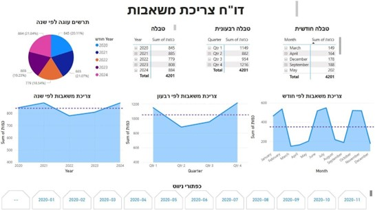
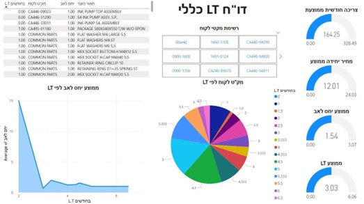
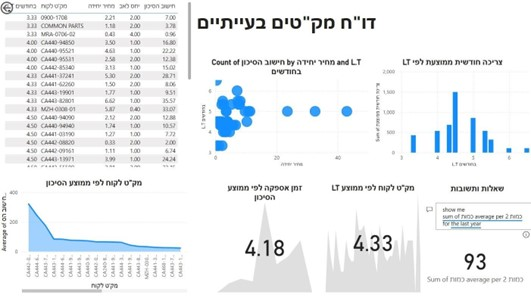

# 📊 Flex Forecasting – Demand Forecasting & Power BI Dashboard

## 📌 Problem  
Flex faced challenges predicting demand for printer assembly items with long and unstable lead times.  
This resulted in emergency orders, higher costs, and difficulties in planning production schedules.  

## 🔄 Process  
- Collected and analyzed historical demand data  
- Applied **SARIMA forecasting model** to improve accuracy  
- Built an **interactive Power BI dashboard** to visualize trends and forecasts  
- Defined KPIs to measure success:  
  - Forecast accuracy (RMSE < 15)  
  - Dashboard adoption (≥ 80% of users)  
  - Lead time reduction (≤ 3 months)  
  - Reduction in emergency orders  

## 🎯 Result  
- A working SARIMA-based forecasting model validated on pumps as a representative case  
- A dynamic dashboard that allows planners and managers to monitor demand and plan procurement more efficiently  

## 💡 Value  
This project demonstrates my ability to:  
- Translate business challenges into analytical solutions  
- Build data-driven tools that support operational decisions  
- Define and track KPIs to measure project success  

---

📷 **Screenshots**

**Pump Consumption Dashboard**  

**General LT Dashboard**  

**Problematic Items Dashboard**  

🛠️ **Tools & Technologies**  
- Python (SARIMA)  
- Power BI  
- ERP Priority  
