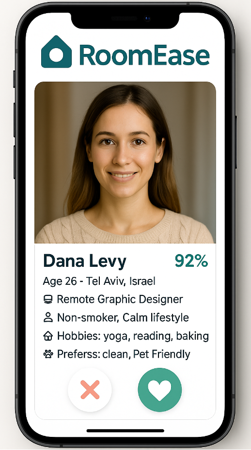
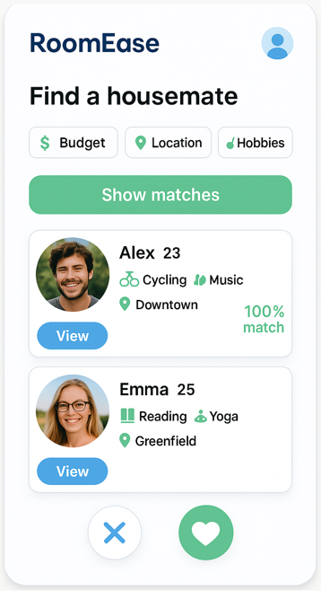

# 🏠 RoomEase – Roommate Matching App  

## 📌 Problem  
Finding reliable roommates is often stressful, inefficient, and lacks transparency.  
Current platforms mainly focus on listings, not on **compatibility** between people.  

## 🔄 Process  
- Defined the main pain point: lack of personalized roommate matching  
- Designed two initial UI screens to represent the core idea  
- Built user flow around:  
  1. Viewing an individual roommate profile  
  2. Searching & matching with multiple candidates  

## 🎯 Result  
- Two prototype screens demonstrating the MVP concept  
- Showcased the potential of a platform that prioritizes compatibility and lifestyle fit  

## 💡 Value  
This project highlights my ability to:  
- Identify a market gap and translate it into a product concept  
- Build a clear **MVP prototype** that demonstrates the app’s core value  
- Focus on **user experience and KPIs** such as retention, active matches, and engagement  

---

📷 **Screenshots**  

**Roommate Profile View**  
  

**Find a Housemate View**  
  
